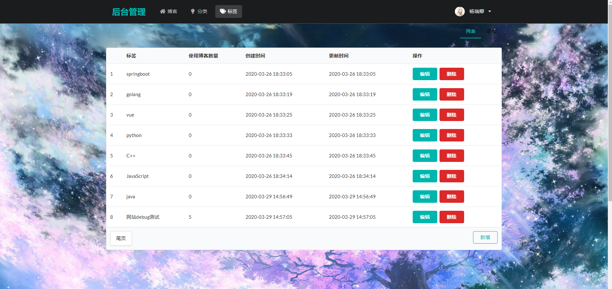

# 20年做的项目 项目比较新  今年测试了依旧可以使用
mysql 用的 8.0以上的版本
如果你使用的是mysql5的话请记得切换

如果感觉不错 请留下你的star吧
开源不易感谢！

# hello !!
    spring boot 2.2.5+ mybatis plus 3.3.1.tmp+ thymeleaf 全栈博客
    + Shiro安全验证框架(使用md5盐值加密)+sematic UI+看板娘+Jquery

    项目已经部署了可以访问
    www.yrqblog.top

# 2020.3.29更新
    网站正式上线

# 网站技术内容

使用了阿里云的t5服务器
服务器为 Linux的Centos版本   
单核2GB 40GB硬盘

使用的技术有
sematic UI
看板娘
JQuery

然后项目管理使用了Maven
前端使用vscode开发
后端使用idea开发
数据库使用Navicat开发  
mysql 版本 8.0.17
 连接druid阿里数据库池

代码管理
使用git+sourceTree

用户分为三种
认证（采用md5盐值加密）和授权 
真正的项目角色是分表的
admin 拥有所有权限
user  可以进行评论,留言,修改头像
guest  只能单纯浏览

大项目一般都是
三张表
用户表 角色表 权限表

前台登录
http://localhost:8080
yrq
123456

后台登录
http://localhost:8080/admin
yrq
123456

